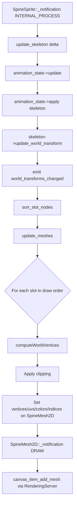
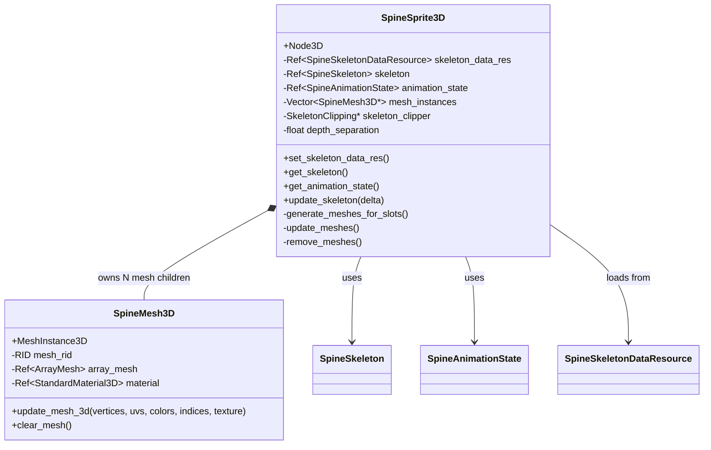
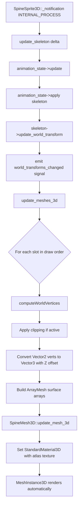

# Spine Godot 3D Port — Architectural Plan

## 1. Analysis Summary

### 1.1 Existing 2D Architecture

The current spine-godot runtime renders Spine skeletons as 2D `CanvasItem`-based nodes:

| Class | Base | Role |
|-------|------|------|
| [`SpineSprite`](spine-godot/spine_godot/SpineSprite.h:133) | `Node2D` | Root node. Owns skeleton, animation state, materials, mesh children. Drives the update loop. |
| [`SpineMesh2D`](spine-godot/spine_godot/SpineSprite.h:52) | `Node2D` | One per slot. Receives vertex/UV/color/index arrays and calls `canvas_item_add_mesh()` via `RenderingServer`. |
| [`SpineSlotNode`](spine-godot/spine_godot/SpineSlotNode.h:41) | `Node2D` | Optional user-facing node for per-slot material overrides and scene insertion between slots. |
| [`SpineBoneNode`](spine-godot/spine_godot/SpineBoneNode.h:41) | `Node2D` | Optional node driven by / driving a Spine bone. Uses `Transform2D`. |
| [`SpineRendererObject`](spine-godot/spine_godot/SpineRendererObject.h:46) | struct | Holds `Ref<Texture>`, `Ref<Texture> normal_map`, `Ref<CanvasTexture>` per atlas page. |

### 1.2 2D-Specific Dependencies Found

| Dependency | Where Used | 3D Replacement |
|---|---|---|
| `Node2D` base class | `SpineSprite`, `SpineMesh2D`, `SpineSlotNode`, `SpineBoneNode` | `Node3D` |
| `CanvasItem` draw API | `canvas_item_add_mesh()`, `canvas_item_clear()`, `draw_polyline()`, `draw_colored_polygon()` | `MeshInstance3D` + `ArrayMesh` |
| `CanvasItemMaterial` | Default blend mode materials in `SpineSpriteStatics` | `StandardMaterial3D` or `ShaderMaterial` |
| `CanvasTexture` | `SpineRendererObject::canvas_texture` | `StandardMaterial3D` with albedo texture |
| `Transform2D` | `SpineBone::get_global_transform()`, `SpineBoneNode`, `SpineSlotNode` | `Transform3D` with Z=0 plane mapping |
| `get_canvas_item()` | `SpineMesh2D::update_mesh()` | Not needed; use `MeshInstance3D` directly |
| `set_draw_behind_parent()` | Slot ordering | Z-offset per slot in 3D |
| `queue_redraw()` / `NOTIFICATION_DRAW` | Triggers 2D re-render | Rebuild `ArrayMesh` surfaces directly |
| `Vector2` vertices | Spine world vertex output | `Vector3` with Y mapped |

### 1.3 Rendering Pipeline Flow (2D — Current)



## 2. 3D Port Strategy

### 2.1 Core Principle: Additive, Not Destructive

All new 3D classes are **new files alongside the existing 2D code**. We do NOT modify:

- `SpineSprite.h/.cpp` 
- `SpineMesh2D`
- `SpineSlotNode` / `SpineBoneNode`
- `SpineSkeleton`, `SpineAnimationState`, `SpineBone`, or any spine-cpp core
- `SpineRendererObject` (extend only if necessary, otherwise wrap)

### 2.2 New Classes



### 2.3 Coordinate Space Mapping

Spine uses a 2D coordinate system with Y-down (since `Bone::setYDown(true)` is called).

For 3D, we map Spine XY to **Godot XY plane** (the skeleton faces the camera along -Z):

| Spine Coord | Godot 3D Coord |
|---|---|
| X | X (unchanged) |
| Y | Y (unchanged, spine Y-down maps to Godot Y) |
| Z (depth) | -Z (small offsets per slot for draw ordering) |

This means the skeleton is rendered on the XY plane with the camera looking along -Z, which is the natural Godot 3D billboard orientation. The character faces the camera in a typical setup.

### 2.4 Depth Sorting Strategy

Each slot gets a small Z offset based on its draw order index:

```
z_offset = slot_draw_order_index * depth_separation
```

Where `depth_separation` is a configurable property (default: `0.001`). This uses the natural depth buffer to maintain correct visual stacking without disabling depth test.

### 2.5 Material Strategy

Each `SpineMesh3D` gets a `StandardMaterial3D` configured as:

```
shading_mode = SHADING_MODE_UNLIT
transparency = TRANSPARENCY_ALPHA
cull_mode = CULL_DISABLED
vertex_color_use_as_albedo = true
albedo_texture = <from SpineRendererObject>
no_depth_test = false  (depth test ON; Z offsets handle ordering)
```

Materials are cached per atlas page texture to avoid redundant allocations.

### 2.6 Rendering Pipeline Flow (3D — New)



## 3. Detailed File Plan

### 3.1 `SpineSprite3D.h`

```cpp
// New file: spine-godot/spine_godot/SpineSprite3D.h
// Extends: Node3D
// Mirrors SpineSprite API but renders via MeshInstance3D children
```

Key members:
- `Ref<SpineSkeletonDataResource> skeleton_data_res` — Same resource, fully shared with 2D
- `Ref<SpineSkeleton> skeleton` — Same wrapper, no changes needed
- `Ref<SpineAnimationState> animation_state` — Same wrapper
- `Vector<SpineMesh3D*> mesh_instances` — One per slot (like `SpineMesh2D` in 2D)
- `spine::SkeletonClipping* skeleton_clipper` — Reuse clipping logic
- `float depth_separation` — Z gap between slots (default 0.001)
- `SpineConstant::UpdateMode update_mode`
- `float time_scale`
- `HashMap<RID, Ref<StandardMaterial3D>> material_cache` — Cache by texture RID

Signals: Same as `SpineSprite` (animation_started, animation_ended, etc.)

### 3.2 `SpineSprite3D.cpp`

Core implementation logic, largely adapted from `SpineSprite.cpp`:

- `update_skeleton()` — Identical logic: update animation state, apply, update world transforms, call `update_meshes_3d()`
- `update_meshes_3d()` — Adapted from `SpineSprite::update_meshes()`:
  - Iterates draw order slots
  - Computes world vertices (same `computeWorldVertices` calls)
  - Handles `RegionAttachment` and `MeshAttachment`
  - Applies clipping via `SkeletonClipping`
  - Converts 2D vertex pairs to `Vector3(x, y, slot_z_offset)`
  - Sends data to `SpineMesh3D::update_mesh_3d()`
- `generate_meshes_for_slots()` — Creates `SpineMesh3D` children
- `remove_meshes()` — Cleans up mesh children
- `callback()` — Identical signal emission logic

### 3.3 `SpineMesh3D` (inner class or separate)

Defined as an inner class in `SpineSprite3D.h` (like `SpineMesh2D` is in `SpineSprite.h`):

```cpp
class SpineMesh3D : public MeshInstance3D {
    GDCLASS(SpineMesh3D, MeshInstance3D)
    Ref<ArrayMesh> array_mesh;
    // ...
public:
    void update_mesh_3d(vertices_3d, uvs, colors, indices, texture, material);
    void clear_mesh();
};
```

The `update_mesh_3d` method:
1. Creates/clears `ArrayMesh` surface
2. Builds surface arrays: `ARRAY_VERTEX` (Vector3), `ARRAY_TEX_UV`, `ARRAY_COLOR`, `ARRAY_INDEX`
3. Calls `array_mesh->add_surface_from_arrays()`
4. Assigns cached `StandardMaterial3D` as surface material

### 3.4 Texture/Material Handling

The existing `SpineRendererObject` stores textures per atlas page. For 3D:

- We read `renderer_object->texture` (the `Ref<Texture>` stored there)
- Create a `StandardMaterial3D` per unique texture, configured as unlit + alpha + vertex color
- Cache materials in a `HashMap` on `SpineSprite3D` keyed by texture RID
- No need to modify `SpineRendererObject` — we just read its `texture` field

### 3.5 Registration

In [`register_types.cpp`](spine-godot/spine_godot/register_types.cpp:131):

```cpp
#include "SpineSprite3D.h"
// ...
GDREGISTER_CLASS(SpineSprite3D);
GDREGISTER_CLASS(SpineMesh3D);
```

### 3.6 Build System

[`SCsub`](spine-godot/spine_godot/SCsub:10) already uses `*.cpp` glob:
```python
env_spine_runtime.add_source_files(env.modules_sources, "*.cpp")
```
New `.cpp` files in `spine_godot/` are automatically picked up. No SCsub changes needed.

## 4. What We Do NOT Touch

| File/System | Reason |
|---|---|
| `SpineSprite.h/.cpp` | Existing 2D runtime must remain untouched |
| `SpineMesh2D` | 2D-only rendering helper |
| `SpineSlotNode` / `SpineBoneNode` | 2D node helpers; 3D equivalents are out of scope |
| `SpineSkeleton.h/.cpp` | Core wrapper, no 2D dependencies |
| `SpineAnimationState.h/.cpp` | Core wrapper, no 2D dependencies |
| `SpineBone.h/.cpp` | Has `Transform2D` API but used generically; we read raw world values directly |
| `SpineRendererObject.h` | Read-only access to texture; no modification needed |
| All `spine-cpp/` | Core Spine runtime; completely untouched |
| `SpineAtlasResource.h/.cpp` | Resource loading; shared between 2D and 3D |
| `SpineSkeletonDataResource.h/.cpp` | Resource loading; shared between 2D and 3D |
| `SpineEditorPlugin.h/.cpp` | Editor tooling; out of scope |

## 5. Key Design Decisions

### 5.1 One MeshInstance3D Per Slot (Not Batched)

Mirrors the 2D approach exactly: one `SpineMesh3D` child per slot. This is simple, correct, and allows per-slot material/blend-mode control. Batching is an explicit out-of-scope optimization.

### 5.2 XY Plane (Not XZ)

Rendering on the XY plane is the natural choice because:
- Spine vertex output is already in XY
- No coordinate swizzling needed
- Camera along -Z is the default 3D forward direction in Godot
- For XZ plane (top-down), users can simply rotate the `SpineSprite3D` node 90 degrees on X

### 5.3 StandardMaterial3D (Not ShaderMaterial)

`StandardMaterial3D` with `SHADING_MODE_UNLIT` is simpler than a custom shader, fully supports vertex color + alpha, and requires no shader code. This is sufficient for the initial port.

### 5.4 Transform Approach

Spine bones output `getWorldX()`, `getWorldY()`, `getWorldRotationX()`, etc. For 3D:
- `SpineSprite3D` itself has a `Transform3D` in the scene
- Spine world vertices are computed in local-to-SpineSprite space (same as 2D)
- We convert `Vector2(x, y)` → `Vector3(x, y, z_offset)` per vertex
- The `SpineSprite3D` node transform handles world placement

### 5.5 Blend Modes

For the initial port, only `BlendMode_Normal` (alpha blend) is supported via `StandardMaterial3D`. Additive/multiply/screen would require `next_pass` materials or custom shaders — deferred to a future iteration.

## 6. Implementation Order

1. **Create `SpineSprite3D.h`** — Class declaration with Node3D base, skeleton/animation state, mesh vector
2. **Create `SpineMesh3D`** — MeshInstance3D subclass with `update_mesh_3d()` using ArrayMesh
3. **Create `SpineSprite3D.cpp`** — Port `update_skeleton()`, `update_meshes()`, `generate_meshes_for_slots()`, callbacks
4. **Material cache** — StandardMaterial3D creation/caching per texture
5. **Register classes** — Add to `register_types.cpp`
6. **Test** — Create example GDScript scene with a Spine character in 3D

## 7. Example Usage (GDScript)

```gdscript
# Attach to a Node3D in a 3D scene
extends Node3D

@onready var spine_sprite_3d: SpineSprite3D = $SpineSprite3D

func _ready():
    # skeleton_data_res is set in the inspector, same as 2D
    var anim_state = spine_sprite_3d.get_animation_state()
    anim_state.set_animation("walk", true, 0)
    
    spine_sprite_3d.connect("animation_completed", _on_animation_completed)

func _on_animation_completed(sprite, state, entry):
    print("Animation completed: ", entry.get_animation().get_name())
```
